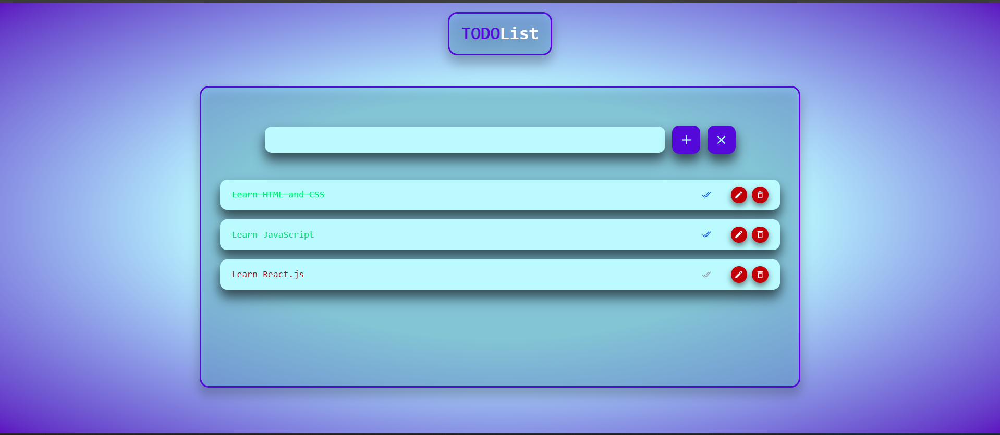

# Todo List App

A clean, interactive and responsive Todo List web application built using **React** and **Tailwind CSS** and used **Vite** as a bundler. It supports creating, editing, marking as complete, and deleting todos. The app persists data using `localStorage`, so your todos are saved even after a page reload.

## Features

- Add new todo tasks
- Edit existing todos
- Delete todos with confirmation
- Mark todos as completed/pending
- Data persists in browser `localStorage`
- Stylish UI with Tailwind CSS and animations

## Screenshots



## Tech Stack

- [React](https://reactjs.org/)
- [VIte](https://vite.dev/guide/)
- [Tailwind CSS](https://tailwindcss.com/)
- [React Icons](https://react-icons.github.io/react-icons/)
- `localStorage` for persistence

## Folder Structure

```bash
src/
├── components/
│ ├── Header.jsx # Renders Header component
│ ├── ToDoItem.jsx # Renders individual todo items
│ └── ToDoList.jsx # Main todo list component
├── App.jsx # App root
├── main.jsx # Entry point
└── index.css # Tailwind and custom styles
```

## Setup & Installation

1. **Clone the repository**

   ```bash
   git clone https://github.com/aayush-joshi1006/todo-list.git
   cd todo-app
   ```

2. **Install Dependencies**

```bash
npm install
```

3. **Run the app**

```bash
npm run dev
```

4. **Open http://localhost:5173 in your browser.**

## Customization

- Edit ToDoItem.jsx or ToDoList.jsx in src/components to adjust behavior.

- Customize styles using Tailwind CSS utility classes.

- Extend animations via Tailwind config or integrate Framer Motion for smoother transitions.

## Contact

#### Developed by Aayush Joshi

#### Project link:- [https://github.com/aayush-joshi1006/todo-list.git](https://github.com/aayush-joshi1006/todo-list.git)

#### Feel free to reach out for feedback or collaboration!
